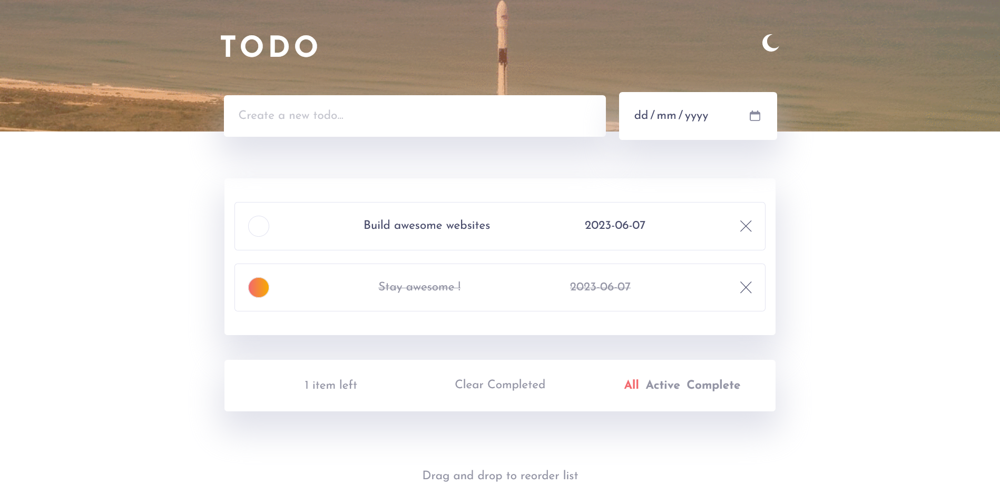

# Todo List Web App

## Table of contents

- [Overview](#overview)

  - [Screenshot](#screenshot)
  - [Features](#features)
  - [Usage](#usage)

- [Development](#development)

  - [Built with](#built-with)
  - [Continued development](#continued-development)

- [Author](#author)

- [Conclusion](#conclusion)

## Overview

The Todo List App is a simple web application that allows users to manage and keep track of their tasks and to-do items. Users can add new tasks, mark them as completed, delete tasks, and filter tasks based on their completion status. The app also includes a Dark Mode feature for users who prefer a darker color scheme.

### Screenshot

### Features

The Todo List App provides the following features:

- Add Task: Users can enter a task title and due date, and click the "Add" button or press Enter to add the task to the list.
- Task Completion: Each task in the list has a checkbox that users can click to mark the task as completed or incomplete. Completed tasks are visually differentiated from incomplete tasks.
- Delete Task: Users can delete a task from the list by clicking the cancel icon associated with the task.
- Drag and Drop: Tasks in the list can be rearranged by dragging and dropping them to a new position.
- Filter Tasks: Users can filter the tasks based on their completion status. They can choose to view all tasks, only active tasks (incomplete tasks), or only completed tasks.
- Items Left Count: The app dynamically displays the count of incomplete tasks.
- Dark Mode: The app includes a Dark Mode feature that users can toggle on or off. Dark Mode provides a darker color scheme for a more comfortable viewing experience in low-light environments.

### Usage

- Add Task: Enter the task title and due date in the corresponding input fields and press Enter.
- Mark Task as Completed/Incomplete: Click the checkbox next to a task to toggle its completion status.
- Delete Task: Click the cancel icon associated with a task to remove it from the list.
- Reorder Tasks: Drag and drop a task to a new position in the list to reorder it.
- Filter Tasks: Click on the "All," "Active," or "Completed" links to filter the tasks accordingly.
- Dark Mode: Click the Dark Mode toggle button to switch between the default color scheme and the Dark Mode.

## Development

The Todo List App is built using HTML, CSS, and JavaScript. It utilizes local storage to store the task list data. The code is structured into separate modules for better organization and maintainability.

### Built with

- Semantic HTML5 markup
- CSS
- Javascript

### Continued development

- Saving dragged item state to localStorage

## Author

- Website - [Adrian Anin](https://adriananin.github.io/anin-blog-odyssey/)
- Frontend Mentor - [@adriananin](https://www.frontendmentor.io/profile/adriananin)

## Conclusion

The Todo List App is a convenient and user-friendly tool for managing tasks and staying organized. With features such as task creation, completion tracking, filtering, and Dark Mode, users can effectively manage their tasks while customizing their viewing experience based on their preferences and environmental conditions.
